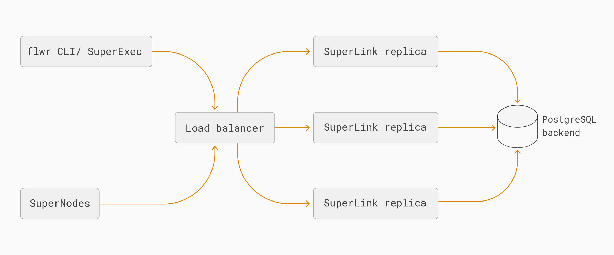
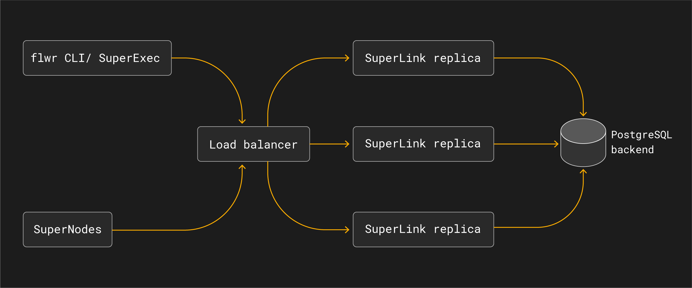

:og:description: Learn how SuperLink High Availability Mode works in Flower SuperGrid, including the load balancer, SuperLink replicas, and PostgreSQL-backed shared state.
.. meta::
    :description: Learn how SuperLink High Availability Mode works in Flower SuperGrid, including the load balancer, SuperLink replicas, and PostgreSQL-backed shared state.

##################################
 SuperLink High Availability Mode
##################################

SuperLink High Availability Mode is an architecture for running SuperLink without a
single SuperLink process acting as the only entry point for a federation. Instead,
traffic is routed through a load balancer to multiple SuperLink replicas that share
durable state in a PostgreSQL backend.

.. important::

    SuperLink High Availability Mode is available in preview. To discuss production
    requirements or request preview access, contact the Flower team at hello@flower.ai.

This page describes the architecture at a high level. It is not a deployment guide.

**************
 Architecture
**************

In a standard Deployment Runtime setup, callers and SuperNodes connect to one
long-running SuperLink. In High Availability Mode, callers and SuperNodes connect to a
stable load-balanced endpoint. The load balancer distributes requests across multiple
SuperLink replicas. Each replica reads and writes shared state through the same
PostgreSQL backend, so the replicas observe the same federation, run, node, message, and
object state.

The main components are:

- **Load balancer**: exposes the stable SuperLink endpoint used by ``flwr`` CLI
  commands, SuperNodes, and SuperExec processes. It routes traffic only to healthy
  SuperLink replicas.
- **SuperLink replicas**: run the same SuperLink service role in parallel. Any healthy
  replica can handle requests for the federation because state is externalized.
- **PostgreSQL backend**: stores shared SuperLink state durably so replicas can observe
  the same runs, messages, node registrations, and object metadata.
- **SuperNodes and SuperExec**: continue to connect to a SuperLink endpoint. They do not
  need to know which SuperLink replica handles an individual request.

************************
 Operational properties
************************

High Availability Mode is designed to reduce the impact of losing an individual
SuperLink process. If one SuperLink replica becomes unavailable, the load balancer can
route new requests to another healthy replica while the shared PostgreSQL backend
continues to provide the federation state.

This changes the deployment architecture of the SuperLink layer, but it does not change
the Flower app programming model:

- ``ServerApp`` and ``ClientApp`` code remains the same.
- SuperNodes connect to the configured SuperLink endpoint, not to individual replicas.
- Operators monitor and scale SuperLink replicas as part of the SuperGrid deployment.
- The load balancer and PostgreSQL backend become critical infrastructure and must be
  operated with their own availability, backup, and monitoring strategy.

High Availability Mode should be understood as part of a production SuperGrid
architecture. It improves resilience at the SuperLink layer, but end-to-end production
availability still depends on the surrounding infrastructure, including load balancing,
database availability, networking, authentication services, and application-level retry
behavior.
