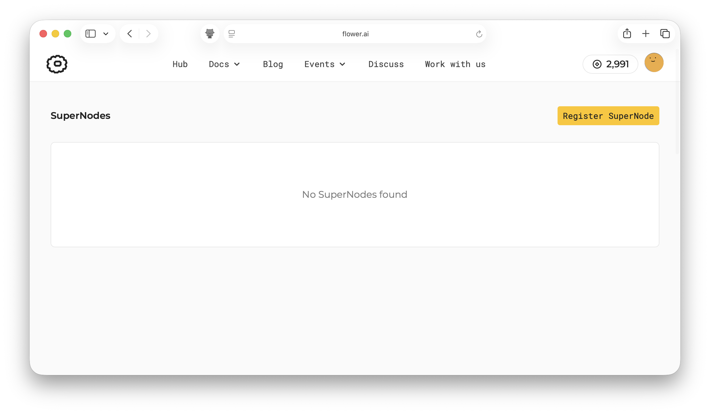
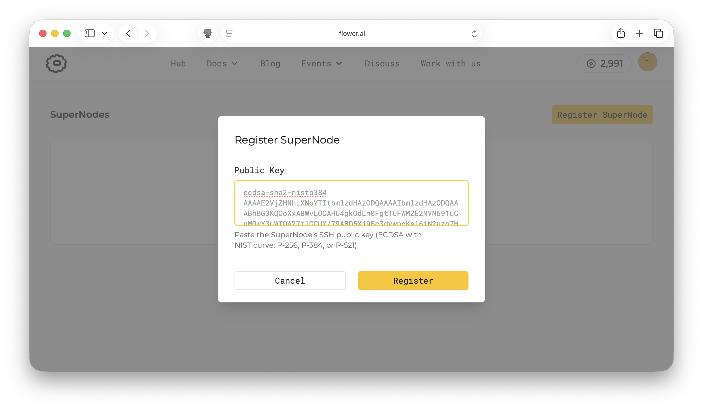
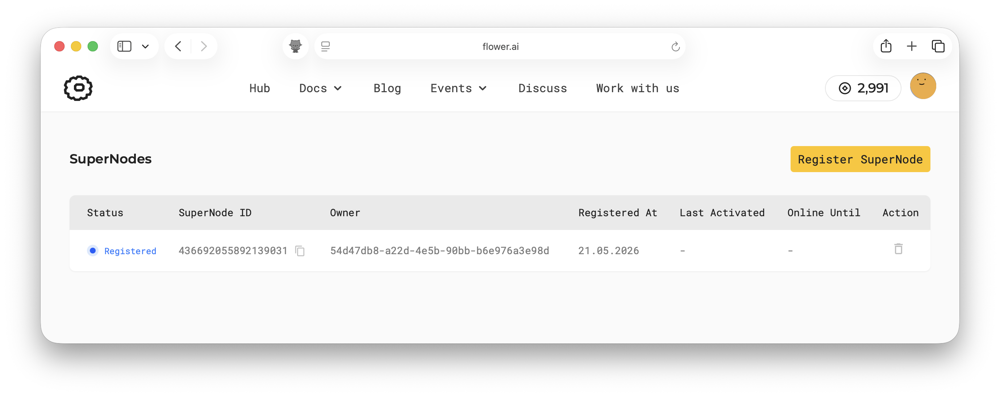
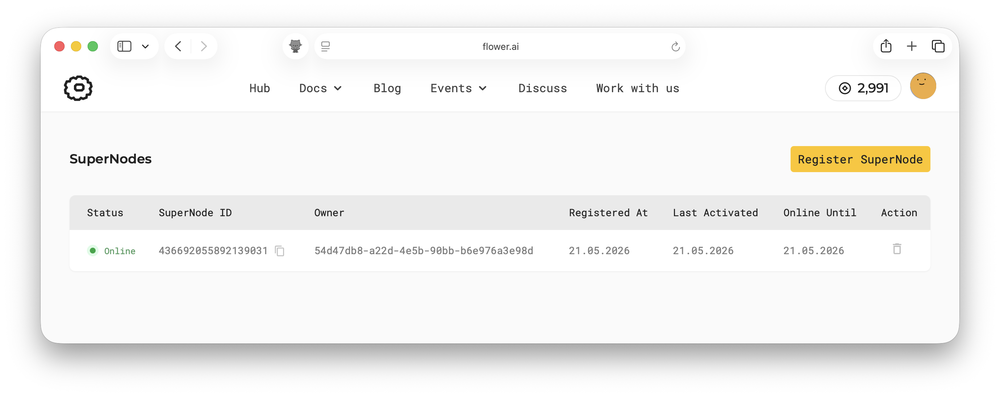
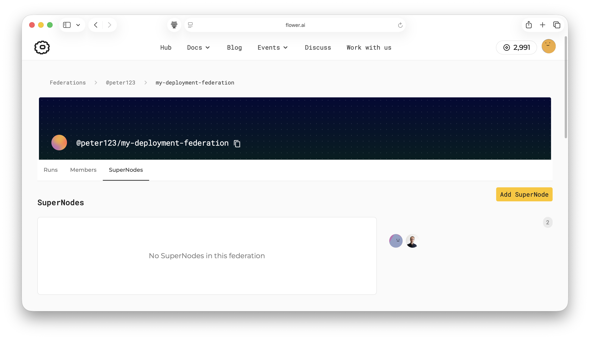
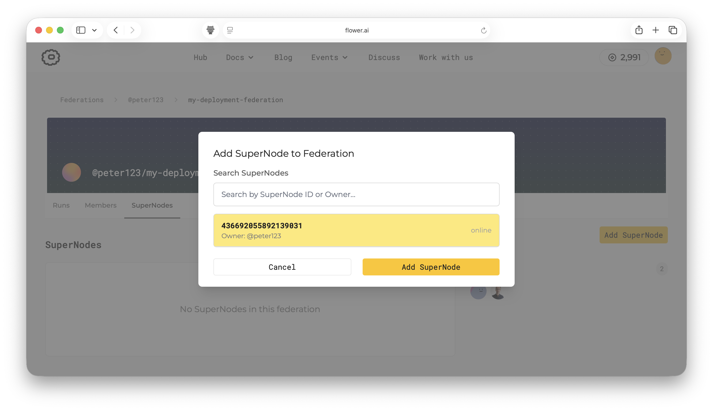
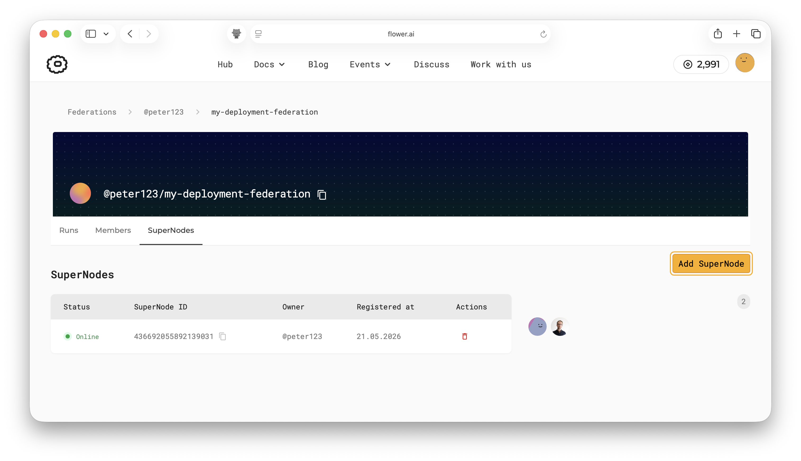

:og:description: Connect SuperNodes to Flower SuperGrid by registering their public keys and starting them from Python or Docker.
.. meta::
    :description: Connect SuperNodes to Flower SuperGrid by registering their public keys and starting them from Python or Docker.

#################################
 Connect SuperNodes to SuperGrid
#################################

This guide shows how to register a SuperNode in SuperGrid and start the
``flower-supernode`` process so it can connect to SuperGrid. Once connected, the
SuperNode can participate in runs submitted to federations that include it.

.. note::

    This guide assumes you already have a Flower account on `flower.ai
    <https://flower.ai/>`__ and can access SuperGrid. Connecting SuperNodes may require
    additional access. Contact hello@flower.ai to request it.

You will need:

- Access to SuperGrid at https://flower.ai/supernodes/.
- Access to a ``Deployment`` federation. ``Simulation`` federations do not support
  adding SuperNodes.
- A public/private key pair for each SuperNode you want to connect. This tutorial shows
  how to create these with ``ssh-keygen`` in the terminal.
- A machine where the SuperNode process can keep running.

************************************
 Register SuperNodes with SuperGrid
************************************

Each SuperNode uses its own key pair. The public key is registered with SuperGrid, and
the private key stays on the machine that runs the SuperNode.

Create a key pair for the first SuperNode:

.. code-block:: shell

    # Create the directory where you'll keep SuperNode keys if it doesn't exist
    $ mkdir -p ~/supernodes_keys
    $ ssh-keygen -t ecdsa -b 384 -N "" -f ~/supernodes_keys/supernode-1

This creates two files:

- ``~/supernodes_keys/supernode-1``: the private key, used when starting the SuperNode.
  Never share the private key or upload it anywhere. This key should only be used to
  start the SuperNode.
- ``~/supernodes_keys/supernode-1.pub``: the public key, used when registering the
  SuperNode in SuperGrid.

Copy the contents of ``supernode-1.pub`` to your clipboard. One way to inspect the
public key is with the ``cat`` command:

.. code-block:: shell

    $ cat ~/supernodes_keys/supernode-1.pub

    # It should print something like this:
    ecdsa-sha2-nistp384 AAAAE2VjZHNhLXNX/7....rxlJbNiDGwQ4YEVw== <username>@<hostname>

Copy the full key printed in the terminal, including the key type at the beginning and
the optional comment at the end.

Then, go to https://flower.ai/supernodes/ and click ``Register SuperNode``.

In the dialog, paste the public key and click ``Register``.

The SuperNode should then appear in the list of registered SuperNodes.

To connect more SuperNodes, create and register a separate key pair for each one. Do not
reuse a key pair across multiple SuperNodes.

*********************************
 Connect SuperNodes to SuperGrid
*********************************

There are two common ways to run a SuperNode: directly from a Python environment, or
with the official SuperNode Docker image. In both cases, use the private key that
matches the public key you registered in SuperGrid.

.. note::

    A SuperNode must be able to run the ClientApps assigned to it. Make sure the
    SuperNode environment or Docker image includes the dependencies those ClientApps
    need, such as PyTorch, TensorFlow, pandas, or other framework-specific packages. You
    can preinstall them in the Python environment, build a custom Docker image with the
    required packages, or start the SuperNode with
    ``--allow-runtime-dependency-installation`` so app dependencies are installed at
    runtime.

Start from a Python environment
===============================

Install Flower in a Python environment on the machine that will run the SuperNode:

.. code-block:: shell

    $ pip install -U flwr

Start the SuperNode:

.. code-block:: shell

    $ flower-supernode \
        --superlink fleet-supergrid.flower.ai:443 \
        --auth-supernode-private-key ~/supernodes_keys/supernode-1

Keep this process running for as long as you want the SuperNode to remain connected.

Your SuperNode should appear as ``online``:

Start with Docker
=================

You can also run the SuperNode with the official `flwr/supernode Docker image
<https://hub.docker.com/r/flwr/supernode>`__. Mount the directory containing the private
key into the container, then pass the key path to ``flower-supernode``:

.. code-block:: shell
    :substitutions:

    $ docker run --rm \
        --user "$(id -u):$(id -g)" \
        -e FLWR_HOME=/tmp/flwr-home \
        -v "$HOME/supernodes_keys:/keys:ro" \
        flwr/supernode:|stable_flwr_version| \
        --superlink fleet-supergrid.flower.ai:443 \
        --auth-supernode-private-key /keys/supernode-1

.. dropdown:: Understand the command

    * ``--rm``: Remove the container after it exits.
    * ``--user "$(id -u):$(id -g)"``: Run the container as the host user that owns the
      mounted private key. Flower Docker images run as a non-root user by default; this
      keeps the container non-root while allowing it to read keys created by
      ``ssh-keygen`` without changing their file permissions.
    * ``-e FLWR_HOME=/tmp/flwr-home``: Set Flower's home directory to a
      container-local writable location. The SuperNode uses this directory to store
      Flower Apps received during runs.
    * ``-v "$HOME/supernodes_keys:/keys:ro"``: Mount the host directory containing the
      SuperNode private key into the container as read-only. You may need to adjust
      the path if your key has a different name or is in a different location.
    * ``flwr/supernode:XYZ``: Use the official SuperNode Docker image.
    * ``--superlink fleet-supergrid.flower.ai:443``: Connect the SuperNode to
      SuperGrid.
    * ``--auth-supernode-private-key /keys/supernode-1``: Use the mounted private key
      to authenticate this SuperNode. You may need to adjust the path if your key has
      a different name or is in a different location.

Use this form when you prefer to run SuperNodes from a container image instead of
installing Flower directly in a Python environment.

********************************************
 Add a SuperNode to a Deployment Federation
********************************************

After registering a SuperNode in SuperGrid, you can add it to any deployment federation
you are a member of. The SuperNode can then participate in runs launched in that
federation.

Navigate to the federation page in SuperGrid and open the ``SuperNodes`` tab. If the
federation does not have any SuperNodes yet, the list will be empty. Click ``Add
SuperNode``.

Select the SuperNode you want to add. You can search by SuperNode ID or owner if the
list contains many SuperNodes. Then click ``Add SuperNode``.

Once added, the SuperNode is listed in the federation's ``SuperNodes`` tab and can be
selected by runs launched in the federation.

