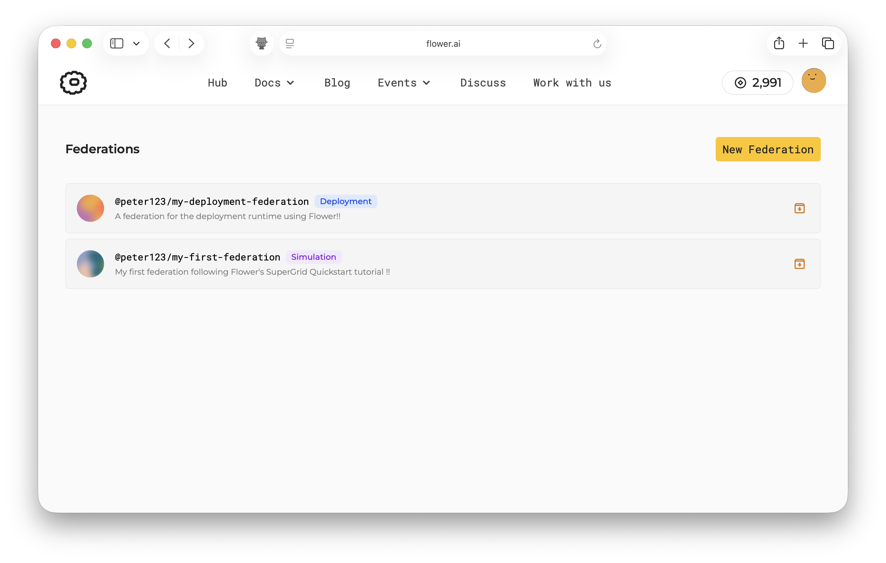
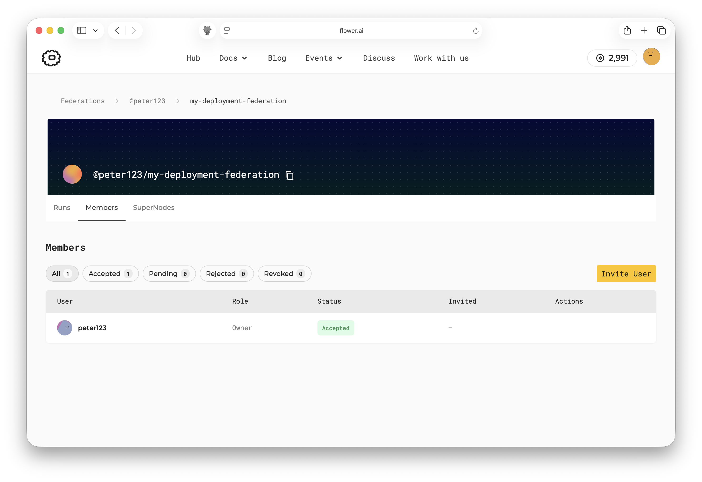
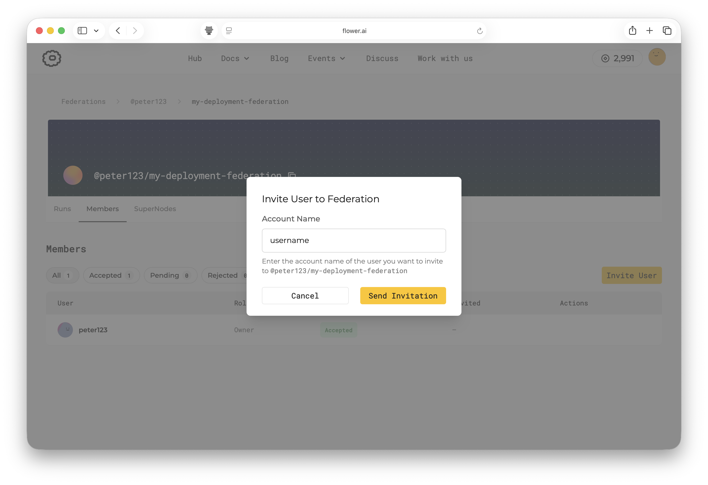
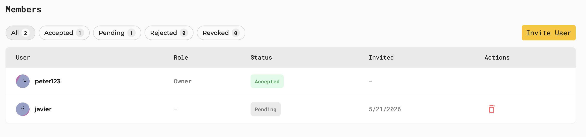
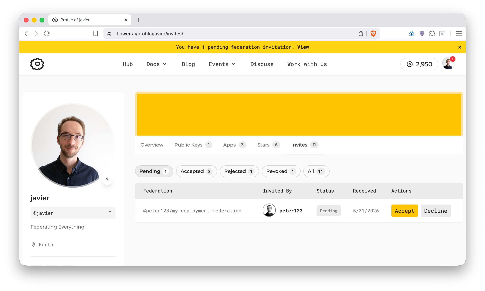
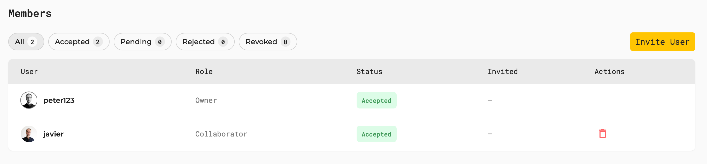
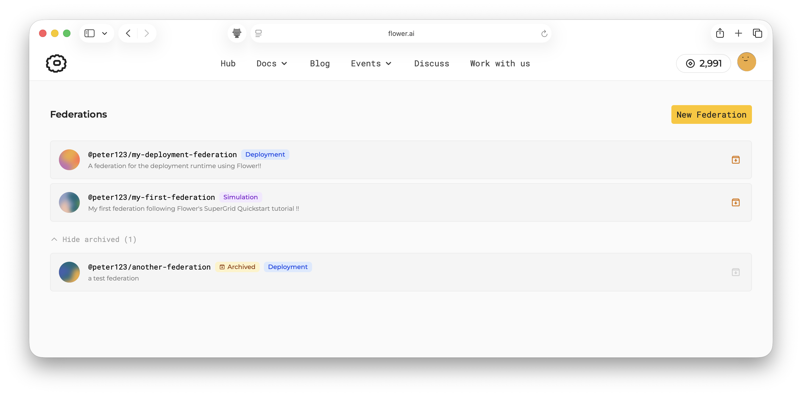

:og:description: Create and manage Flower federations in SuperGrid.
.. meta::
    :description: Create and manage Flower federations in SuperGrid.

############################################
 Create and Manage Federations on SuperGrid
############################################

This guide shows how to create and manage federations in SuperGrid. A federation is a
workspace for a group of users and the SuperNodes that can take part in Flower runs.

.. note::

    This guide assumes you already have a Flower account on `flower.ai
    <https://flower.ai/>`__ and can access SuperGrid.

SuperGrid supports two federation types:

- **Simulation federations** run Flower Apps with simulated SuperNodes. Use this when
  you want to test or iterate on an app before connecting real SuperNodes.
- **Deployment federations** run Flower Apps on connected SuperNodes.

.. note::

    Deployment federations require deployment access. Contact hello@flower.ai to request
    it.

All federation members can see runs launched by other members. They can also launch new
runs in the federation.

The sections below show the SuperGrid UI workflow. At the end of this page, the same
steps are shown in compact form with the Flower CLI.

*********************
 Create a Federation
*********************

Open SuperGrid and go to `the Federations page <https://flower.ai/federations/>`__.
Choose whether you want to create a simulation federation or a deployment federation,
then provide the federation name and the required configuration.

.. note::

    There is no limit on the number of federations you can create.

To create a simulation federation, click ``New Federation``, select ``Simulation``,
choose a federation name, set the number of simulated SuperNodes, and click ``Create``.
You can change the number of simulated SuperNodes later if needed. To begin with, start
with a small number of SuperNodes, such as 5 or 10, to keep runs fast.

For a deployment federation, choose ``Deployment`` instead of ``Simulation`` when
creating the federation. Choose a meaningful name and click ``Create``.

In the federations dashboard, you can identify the type of each federation by the label
next to its name. The screenshot below shows two federations, one for simulation and one
for deployment.

For deployment federations, you also need to add SuperNodes to the federation. You can
add your own SuperNodes now by following the :doc:`guide on how to connect SuperNodes to
SuperGrid <how-to-connect-supernodes-to-supergrid>`, or you can do it later. SuperGrid
federations become most useful when several members collaborate on runs, each with their
own SuperNodes. The next section shows how to invite other users to join.

*********************
 Manage a Federation
*********************

After creating a federation, the owner can invite other Flower users to collaborate.
Invited users become federation members after accepting the invitation. Members can
connect their own SuperNodes, inspect runs launched in the federation, and submit their
own runs.

Federation ownership controls administrative actions:

- The owner can invite users.
- The owner can remove users from the federation.
- The owner can archive the federation when the collaboration is complete.
- Members can leave the federation themselves.

Invite Users
============

Invite users when you want multiple people to collaborate in the same federation,
inspect runs, launch new runs, and contribute their own SuperNodes. You can invite users
to both simulation and deployment federations, but only deployment federations can have
real SuperNodes connected to them.

Open your federation and navigate to the ``Members`` tab. If this is a new federation,
you will see only your own account listed as the owner.

Click ``Invite User``, enter the username of the Flower account you want to invite, and
click ``Send Invitation``.

The invitation appears in the member list with status ``Pending`` until the invited user
accepts it. While it is pending, the owner can revoke the invitation by clicking the
delete icon.

The invited user will see the invitation when they sign in to `flower.ai
<https://flower.ai/>`__ and open their profile page. The invitation shows the federation
name and the username of the user who sent it.

After accepting the invitation, the user becomes a member of the federation. From that
point on, the user can see the federation in their dashboard, inspect runs, launch new
runs, and, for deployment federations, connect their own SuperNodes. Members can leave
the federation at any time.

Archive a Federation
====================

Archive a federation when a project or collaboration has ended. Only the federation
owner can archive it.

To archive a federation, click the archive icon shown in the federations dashboard.
After confirming, the federation is archived and moved to the archived federations list.
The screenshot below shows ``@peter123/another-federation`` after it has been archived.

Before archiving a federation, make sure the collaboration is complete and members no
longer need to launch workloads in it. Once archived, the federation is kept as a
historical record instead of an active workspace. New runs cannot be launched, and users
or SuperNodes can no longer be added or removed.

**********
 Advanced
**********

Everything shown above in the SuperGrid UI can also be done with the :doc:`Flower CLI
<ref-api-cli>`.

Log in to SuperGrid:

.. code-block:: shell

    $ flwr login supergrid

Create federations:

.. code-block:: shell

    # Create a deployment federation
    $ flwr federation create <federation-name> supergrid \
        --description "<federation-description>"

    # Create a simulation federation
    $ flwr federation create <federation-name> supergrid \
        --description "<federation-description>" \
        --simulation

List federations and show federation details:

.. code-block:: shell

    # List all federations you are a member of
    $ flwr federation list supergrid
    # Show details of a federation (i.e. members, SuperNodes, runs)
    $ flwr federation list supergrid --federation @<username>/<federation-name>

Configure a simulation federation. For example, change the number of simulated
SuperNodes:

.. code-block:: shell

    $ flwr federation simulation-config @<username>/<federation-name> supergrid \
        --num-supernodes 20

.. note::

    For more Simulation Runtime options, see the ``Customize the Simulation Runtime``
    section in the :doc:`Simulation Runtime documentation <how-to-run-simulations>`.

Manage federation invitations:

.. code-block:: shell

    # Create an invitation for a user to join a federation
    $ flwr federation invite create <account-name> \
        @<username>/<federation-name> supergrid
    # List invitations for your account (created and received)
    $ flwr federation invite list supergrid
    # Accept an invitation to join a federation
    $ flwr federation invite accept @<username>/<federation-name> supergrid
    # Revoke an invitation you created
    $ flwr federation invite revoke <account-name> \
        @<username>/<federation-name> supergrid

Remove an account from a federation. This can only be done by the federation owner.

.. code-block:: shell

    $ flwr federation remove-account @<username>/<federation-name> \
        <account-name> supergrid

Archive a federation. This action can only be done by the federation owner and cannot be
undone.

.. code-block:: shell

    $ flwr federation archive @<username>/<federation-name> supergrid
