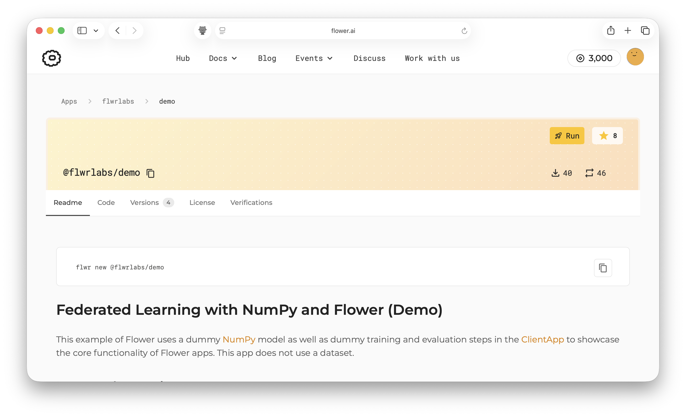
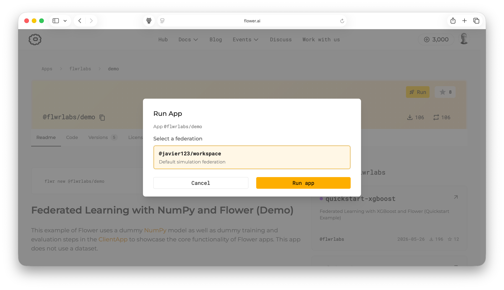
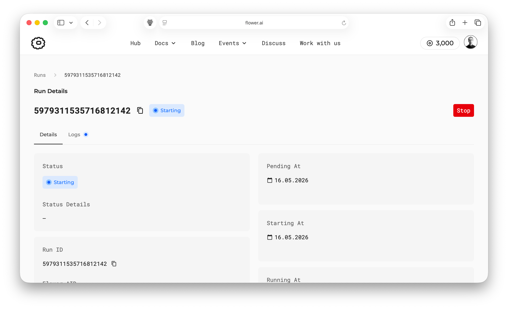
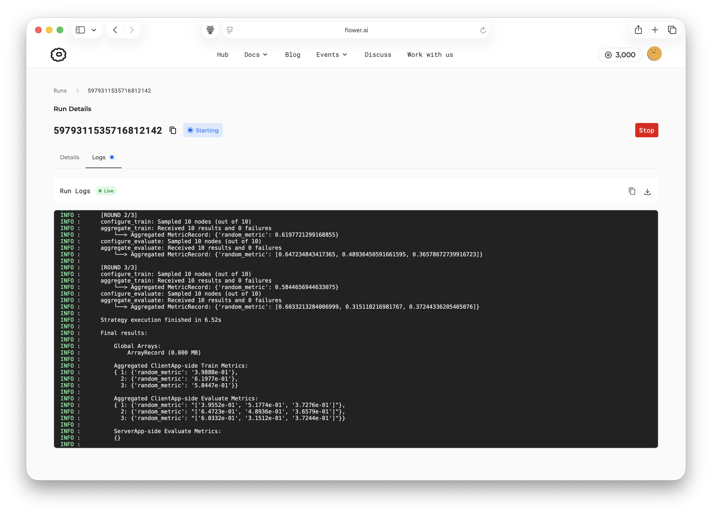
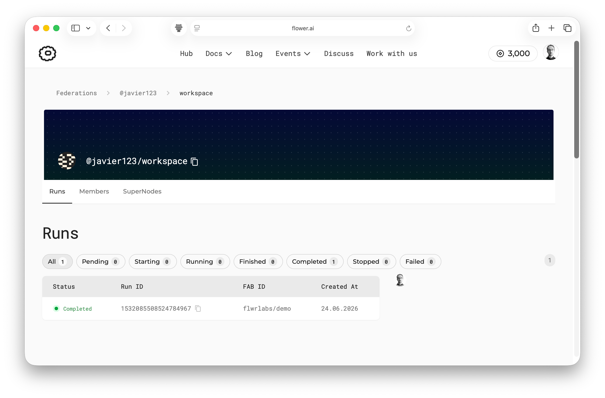

#########################
 Get started with Flower
#########################

Welcome to the Flower collaborative AI tutorial!

In this tutorial, you'll learn how to run a Flower App directly on SuperGrid. You'll use
an existing app from `Flower Hub <https://flower.ai/apps/>`__. This means you won't have
to write any code to complete the tutorial, but you'll still get a practical
introduction to the core concepts of collaborative AI with Flower. You'll also get a
look behind the scenes to understand how Flower executes your app and how the different
components interact with each other.

.. tip::

    `Star Flower on GitHub <https://github.com/flwrlabs/flower>`__ ⭐️ and join the
    Flower community on `Flower Discuss <https://discuss.flower.ai/>`__ or `Flower Slack
    <https://flower.ai/join-slack>`__ to introduce yourself, ask questions, and get
    help.

Let's get started! 🌼

******************
 Access SuperGrid
******************

The only prerequisite for this tutorial is to have an account for SuperGrid. Sign up on
`flower.ai <https://flower.ai/>`__ or log in if you already have an account.

******************
 Run a Flower App
******************

Once you have logged into flower.ai, you are ready to start running Flower Apps. A
Flower App is a Python project that defines the logic of your collaborative AI workload.
More details will be covered in the next tutorial, but for now you can think of a Flower
App as the code that defines what happens on the server (SuperGrid) and SuperNodes
during your collaborative AI workload.

`Flower Hub <https://flower.ai/apps/>`__ is a collection of open-source Flower Apps that
you can use and learn from. In this tutorial, you'll use the `@flwrlabs/demo
<https://flower.ai/apps/flwrlabs/demo/>`__ app. It is maintained by the Flower team and
runs a simple collaborative AI workload in which the server aggregates NumPy arrays sent
by the clients.

When you click the ``🚀 Run`` button, you'll be asked which federation to run the app on.
Select ``@<your-account>/workspace`` (this is a federation created automatically by
SuperGrid under your profile), then click ``Run app``.

Shortly after launching your app, your run will start and you will see the run details
page. This page shows you the progress of your run and gives you insights into the
execution of your app.

If you click the ``Logs`` tab, you'll see the logs from the app execution. This demo app
ran for three rounds and sampled all two SuperNodes in each round. In each round, the
server aggregated different metrics received from the clients. You can see these in the
logs under the ``'random_metric'`` key. At the end, the logs show the aggregated results
from all rounds.

***************
 Final remarks
***************

Congratulations, you have successfully run your first Flower App on SuperGrid! You've
taken your first step into the world of collaborative AI with Flower. In this tutorial,
you created a federation with simulated SuperNodes and ran an existing Flower App across
them. You also explored the SuperGrid dashboard to monitor your app's progress and view
its logs.

If you return to the `Federations page <https://flower.ai/federations/>`__ and click
your federation, you'll see the run you launched. You can click that run to open the
same run details page you saw right after launching the app.

In the next tutorial, you'll download an existing Flower App, run it from your local
machine on SuperGrid, make a small customization, and learn how the main Flower App
components fit together.

************
 Next steps
************

Before you continue, make sure to join the Flower community on Flower Discuss (`Join
Flower Discuss <https://discuss.flower.ai>`__) and on Slack (`Join Slack
<https://flower.ai/join-slack/>`__).

There's a dedicated ``#questions`` Slack channel if you need help, but we'd also love to
hear who you are in ``#introductions``!

The :doc:`Flower Collaborative AI Tutorial - Part 2: Write your first Flower App
<tutorial-series-write-your-first-flower-app>` will walk you through the process of
customizing your first Flower App and understanding how components like ``ServerApp``
and ``ClientApp`` interact with each other.
