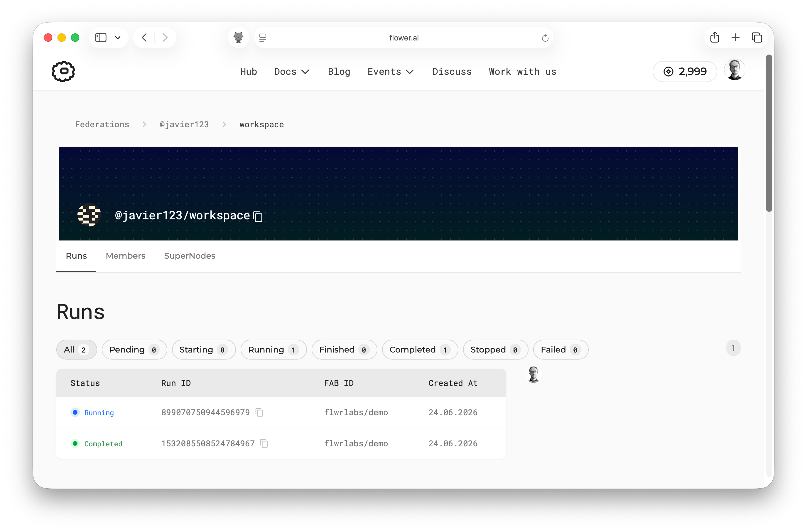
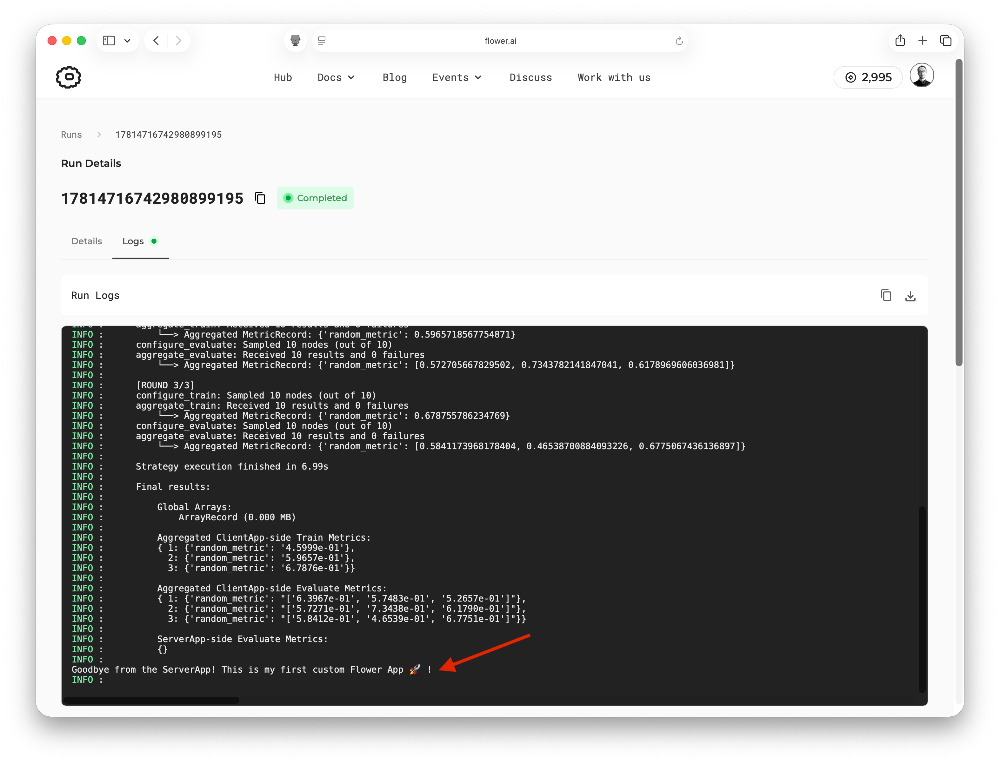

#############################
 Write your first Flower App
#############################

Welcome to the second part of the Flower collaborative AI tutorial!

In the previous tutorial, you ran an existing Flower App on SuperGrid using your default
workspace simulation federation. This allowed you to experiment with simulated
SuperNodes and explore the dashboard to follow the app's progress and view its logs.

In this tutorial, you'll pull the `@flwrlabs/demo
<https://flower.ai/apps/flwrlabs/demo/>`__ app from Flower Hub and run it on SuperGrid
from your local machine. You'll then make a small change to the ``ServerApp``, run the
app again, and confirm in the SuperGrid logs that your custom messages are now part of
the app's behavior. In the second half of the tutorial, you'll step back from the
hands-on workflow to get a high-level introduction to the main components of a Flower
App and see, in concrete terms, how the demo app uses those components together.

.. tip::

    `Star Flower on GitHub <https://github.com/flwrlabs/flower>`__ ⭐️ and join the
    Flower community on `Flower Discuss <https://discuss.flower.ai/>`__ or `Flower Slack
    <https://flower.ai/join-slack>`__ to introduce yourself, ask questions, and get
    help.

Let's get started! 🌼

*************
 Preparation
*************

In this tutorial, you'll edit the code of an existing Flower App that you'll pull from
the Flower Hub. In order to do that, you'll need to install ``flwr``, the Flower Python
package. What follows is a brief guide on how this can be done:

Installing dependencies
=======================

First, we install the Flower package ``flwr`` in a new Python environment.

.. code-block:: shell

    $ pip install -U flwr

Then, use ``flwr new`` to fetch an existing Flower App from the Flower Hub. In this
case, you'll fetch the `@flwrlabs/demo <https://flower.ai/apps/flwrlabs/demo/>`__ app.

.. code-block:: shell

    $ flwr new @flwrlabs/demo

After running it you'll notice a new directory named ``demo`` has been created in the
directory you executed the above command from. It should have the following structure:

.. code-block:: shell

    demo
    ├── quickstart_numpy
    │   ├── __init__.py
    │   ├── client_app.py   # Defines your ClientApp
    │   ├── server_app.py   # Defines your ServerApp
    │   └── task.py         # Defines your model, training and data loading
    ├── pyproject.toml      # Project metadata like dependencies and configs
    └── README.md

You did it! You have pulled an existing Flower App from the Flower Hub. Open the
``demo`` directory in your code editor of choice, then advance to the next section to
learn how to run this app in SuperGrid. Later, you'll learn about the core components of
a Flower App.

**************************
 Run the app on SuperGrid
**************************

.. note::

    If you haven't already, make sure to complete the :doc:`first tutorial in this
    series <tutorial-series-get-started-with-flower>` to set up your SuperGrid account
    and run a demo app on SuperGrid directly from the Flower Hub.

In the previous tutorial, you ran the demo app on SuperGrid directly from Flower Hub.
Now that you have the app code on your machine, you can run it from there instead. This
is a crucial step towards customizing the app and making it your own.

Open a terminal, activate your Python environment, and run the following command to
first login to SuperGrid:

.. code-block:: shell

    # This will open a browser window where you can enter your SuperGrid credentials.
    $ flwr login supergrid

Once you are logged in, run the following command to run the app on SuperGrid:

.. code-block:: shell

    # Navigate to the directory of the app you want to run
    $ cd /path/to/demo
    # Run the app on SuperGrid
    $ flwr run . supergrid

Then, if you navigate to the `SuperGrid dashboard <https://flower.ai/federations/>`__,
you should see a new run in ``@<your-account>/workspace``. Click on it to see the run
details and logs.

If you inspect the logs, you should see the same output as when you ran the app directly
from the Flower Hub in the previous tutorial. This is because you are running the exact
same app. In the next section, we'll make a small modification to the app that will
reflect in the logs and make it your own!

**********************
 Customizing your App
**********************

Now that you have the app running on SuperGrid, you can start customizing it. In this
tutorial you'll make a small customization to the ``ServerApp`` to print a message
before the federated learning begins and just before the app exits. Open the ``demo``
directory in your code editor of choice and open the ``quickstart_numpy/server_app.py``.
Then, add the following two lines to the ``main()`` function:

.. code-block:: python
    :emphasize-lines: 5,22

    @app.main()
    def main(grid: Grid, context: Context) -> None:
        """Main entry point for the ServerApp."""

        print("👋 Hello from the ServerApp! This is a custom message that I added.")
        # Read run config
        num_rounds: int = context.run_config["num-server-rounds"]

        # Load global model
        model = get_dummy_model()
        arrays = ArrayRecord(model)

        # Initialize FedAvg strategy
        strategy = FedAvg()

        # Start strategy, run FedAvg for `num_rounds`
        result = strategy.start(
            grid=grid,
            initial_arrays=arrays,
            num_rounds=num_rounds,
        )
        print("Goodbye from the ServerApp! This is my first custom Flower App 🚀!")

If you now run the app again, you should see the new messages in the logs of your run on
SuperGrid:

.. code-block:: shell

    # Run your app
    $ flwr run . supergrid

Then, if you navigate to the `SuperGrid dashboard <https://flower.ai/federations/>`__,
and open the logs of the new run, you should see the new printed messages from the
``ServerApp`` at the beginning and end of the logs.

You did it! You have successfully customized an existing Flower App and run it on
SuperGrid. So far you have learned about two powerful Flower commands (``flwr new`` and
``flwr run``) that allow you to pull existing apps from the Flower Hub and run them on
SuperGrid. ``flwr new`` is a great way to get started with a new app that you can
customize for your needs.

In the next section, you'll learn about the main components of a Flower App and how they
work together, using the demo app as a concrete example.

***********************
 Flower App Components
***********************

All Flower Apps follow the same basic structure, which is designed to be flexible and
powerful enough to support a wide variety of collaborative AI workloads including
federated learning, federated analytics, distributed training, and more. The main
components of a Flower App are:

- ``ServerApp``: the server-side entry point for a run. In a typical federated learning
  setup, it defines how the run starts, which initial model is used, which strategy
  controls the federated learning process, and how many rounds to execute. A Flower App
  can also be built with a custom strategy or no strategy at all.
- ``ClientApp``: the code that runs on each client (SuperNode). It defines what should
  happen when a SuperNode receives instructions from the server side, for example "train
  this model on your local data" or "evaluate this model on your local data" or, in
  general, "do x with your local data".
- ``pyproject.toml``: the app configuration file. It declares project metadata and
  dependencies, tells Flower where to import the ``ServerApp`` and ``ClientApp`` from,
  and stores run configuration (e.g. hyperparameters) that the app can read at runtime.

In summary, you can think of the ``ServerApp`` as the place where the federated run is
launched, the ``Strategy`` as the algorithm that coordinates each round, and the
``ClientApp`` as the code each participating SuperNode executes. The ``ServerApp`` and
``ClientApp`` exchange ``Message`` objects through SuperGrid. Depending on the logic of
the app, these messages can contain instructions or queries, model parameters, training
metrics, or any other information that needs to be communicated between the server and
SuperNodes during the run.

How the demo app uses these components
======================================

The ``@flwrlabs/demo`` app is built as a deliberately small NumPy example so the Flower
structure is easy to see.

In ``quickstart_numpy/server_app.py``, the ``ServerApp`` is created and defines its main
entry point with ``@app.main()``. When a run starts, this function:

1. reads ``num-server-rounds`` from ``context.run_config``;
2. creates the initial global model by calling ``get_dummy_model()`` from
   ``quickstart_numpy/task.py``; For simplicity, the model is just a list of a single
   NumPy array, but in a real app it could be a more complex object such as a PyTorch
   model.
3. wraps the model arrays in an ``ArrayRecord`` so Flower can send them to SuperNodes;
4. creates a ``FedAvg`` strategy;
5. launches the strategy by calling ``strategy.start()``.

In ``quickstart_numpy/client_app.py``, a ``ClientApp`` is created and defines two
handlers:

- ``@app.train()`` receives the current global model array, simulates local training by
  adding random noise to it, then replies with the updated array and a few metrics.
- ``@app.evaluate()`` receives the current global model array and replies with
  evaluation metrics. It does not return an updated array because evaluation does not
  change the model.

The strategy connects these two sides. In this demo, ``FedAvg`` sends the current global
array to selected ``ClientApp`` instances for training, waits for their replies, and
aggregates the returned arrays into the next global model.

.. note::

    In a real app, the ``ClientApp`` would likely have a more complex logic, for example
    it could load a model and data, perform actual training and evaluation, and return
    updated model parameters and training metrics to the server. In the next tutorial
    you'll see a more complex example of a Flower App that uses PyTorch and real
    training and evaluation logic.

Finally, ``pyproject.toml`` makes the app components discoverable and configurable. The
``[tool.flwr.app.components]`` section points Flower to the objects it should import:

.. code-block:: toml

    serverapp = "quickstart_numpy.server_app:app"
    clientapp = "quickstart_numpy.client_app:app"

The ``[tool.flwr.app.config]`` section defines values available at runtime through
``context.run_config``. In this demo, it sets:

.. code-block:: toml

    num-server-rounds = 3

That is the value the ``ServerApp`` reads to decide how many federated learning rounds
the ``FedAvg`` strategy should run. In a real app, you could have many more
configuration values such as learning rate, batch size, and more.

***************
 Final Remarks
***************

Congratulations, you have successfully run your first custom Flower App on SuperGrid!
You have also learned about the main components of a Flower App and how they work
together to enable collaborative AI workloads across a federation of SuperNodes.

.. tip::

    This tutorial runs the app on SuperGrid with simulated SuperNodes. To run Flower
    Apps on SuperGrid with the Deployment Runtime instead, create a deployment
    federation in the SuperGrid dashboard and connect real SuperNodes to it. See
    :doc:`how-to-create-and-manage-federations` and
    :doc:`how-to-connect-supernodes-to-supergrid`.

In the next tutorial, you will take a look at a more complex Flower App that uses
PyTorch and real training and evaluation logic. You will also learn how to run a Flower
App locally on your machine, which is ideal for development and debugging before running
on SuperGrid.

************
 Next steps
************

Before you continue, make sure to join the Flower community on Flower Discuss (`Join
Flower Discuss <https://discuss.flower.ai>`__) and on Slack (`Join Slack
<https://flower.ai/join-slack/>`__).

There's a dedicated ``#questions`` Slack channel if you need help, but we'd also love to
hear who you are in ``#introductions``!

The :doc:`Flower Collaborative AI Tutorial - Part 3: Write a Flower App for a PyTorch
model <tutorial-series-write-your-first-flower-app-pytorch>` presents a more advanced
Flower App that uses PyTorch and real training and evaluation logic.
