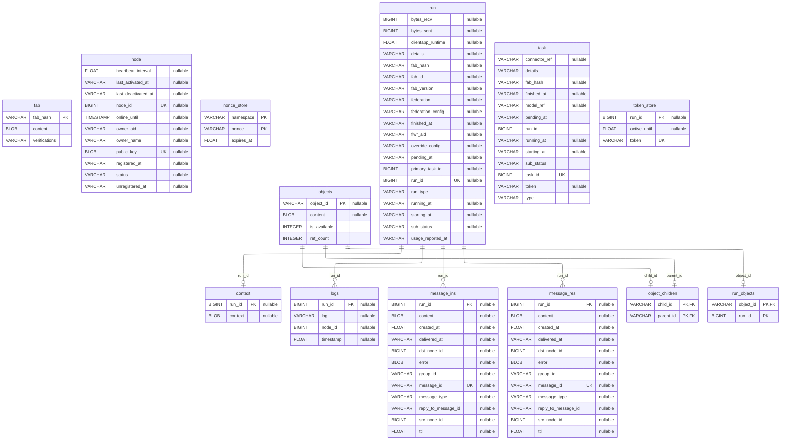

# State Entity Relationship Diagram

## Schema

<!-- BEGIN_SQLALCHEMY_DOCS -->

```mermaid

---
    config:
        layout: elk
---
erDiagram
  context {
    BIGINT run_id FK "nullable"
    BLOB context "nullable"
  }

  fab {
    VARCHAR fab_hash PK
    BLOB content
    VARCHAR verifications
  }

  logs {
    BIGINT run_id FK "nullable"
    VARCHAR log "nullable"
    BIGINT node_id "nullable"
    FLOAT timestamp "nullable"
  }

  message_ins {
    BIGINT run_id FK "nullable"
    BLOB content "nullable"
    FLOAT created_at "nullable"
    VARCHAR delivered_at "nullable"
    BIGINT dst_node_id "nullable"
    BLOB error "nullable"
    VARCHAR group_id "nullable"
    VARCHAR message_id UK "nullable"
    VARCHAR message_type "nullable"
    VARCHAR reply_to_message_id "nullable"
    BIGINT src_node_id "nullable"
    FLOAT ttl "nullable"
  }

  message_res {
    BIGINT run_id FK "nullable"
    BLOB content "nullable"
    FLOAT created_at "nullable"
    VARCHAR delivered_at "nullable"
    BIGINT dst_node_id "nullable"
    BLOB error "nullable"
    VARCHAR group_id "nullable"
    VARCHAR message_id UK "nullable"
    VARCHAR message_type "nullable"
    VARCHAR reply_to_message_id "nullable"
    BIGINT src_node_id "nullable"
    FLOAT ttl "nullable"
  }

  node {
    FLOAT heartbeat_interval "nullable"
    VARCHAR last_activated_at "nullable"
    VARCHAR last_deactivated_at "nullable"
    BIGINT node_id UK "nullable"
    TIMESTAMP online_until "nullable"
    VARCHAR owner_aid "nullable"
    VARCHAR owner_name "nullable"
    BLOB public_key UK "nullable"
    VARCHAR registered_at "nullable"
    VARCHAR status "nullable"
    VARCHAR unregistered_at "nullable"
  }

  nonce_store {
    VARCHAR namespace PK
    VARCHAR nonce PK
    FLOAT expires_at
  }

  object_children {
    VARCHAR child_id PK,FK
    VARCHAR parent_id PK,FK
  }

  objects {
    VARCHAR object_id PK "nullable"
    BLOB content "nullable"
    INTEGER is_available
    INTEGER ref_count
  }

  run {
    BIGINT bytes_recv "nullable"
    BIGINT bytes_sent "nullable"
    FLOAT clientapp_runtime "nullable"
    VARCHAR details "nullable"
    VARCHAR fab_hash "nullable"
    VARCHAR fab_id "nullable"
    VARCHAR fab_version "nullable"
    VARCHAR federation "nullable"
    VARCHAR federation_config "nullable"
    VARCHAR finished_at "nullable"
    VARCHAR flwr_aid "nullable"
    VARCHAR override_config "nullable"
    VARCHAR pending_at "nullable"
    BIGINT primary_task_id "nullable"
    BIGINT run_id UK "nullable"
    VARCHAR run_type
    VARCHAR running_at "nullable"
    VARCHAR starting_at "nullable"
    VARCHAR sub_status "nullable"
    VARCHAR usage_reported_at
  }

  run_objects {
    VARCHAR object_id PK,FK
    BIGINT run_id PK
  }

  task {
    VARCHAR connector_ref "nullable"
    VARCHAR details
    VARCHAR fab_hash "nullable"
    VARCHAR finished_at "nullable"
    VARCHAR model_ref "nullable"
    VARCHAR pending_at
    BIGINT run_id
    VARCHAR running_at "nullable"
    VARCHAR starting_at "nullable"
    VARCHAR sub_status
    BIGINT task_id UK
    VARCHAR token "nullable"
    VARCHAR type
  }

  token_store {
    BIGINT run_id PK "nullable"
    FLOAT active_until "nullable"
    VARCHAR token UK
  }

  run ||--o| context : run_id
  run ||--o{ logs : run_id
  run ||--o{ message_ins : run_id
  run ||--o{ message_res : run_id
  objects ||--o| object_children : parent_id
  objects ||--o| object_children : child_id
  objects ||--o| run_objects : object_id

```
<!-- END_SQLALCHEMY_DOCS -->
